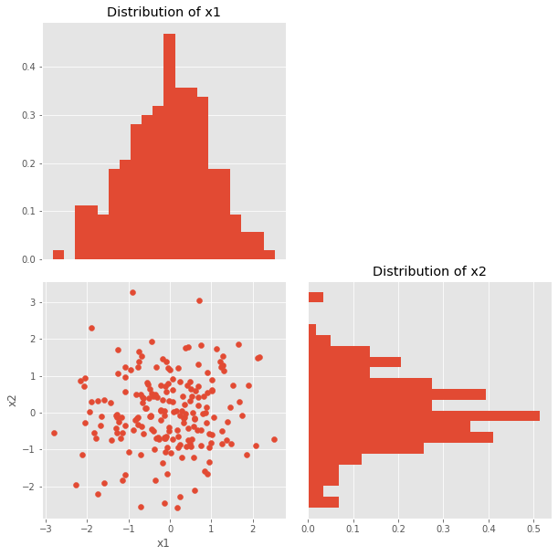
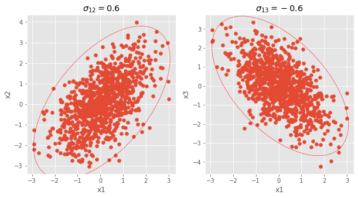
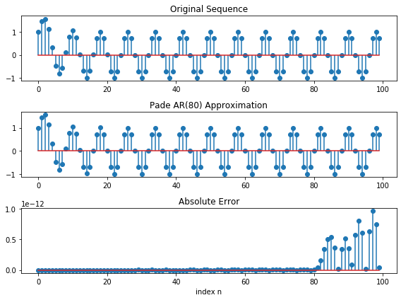

# Statistical Signal Processing 
This Repository contains Jupyter Notebooks that explains the fundamental concepts in Statistical Signal Processing. 

# Sample Outputs
* Visualizing Distribution as Scatter Plot

* Learning Parameter

* Approximation of Random Process by Prony Method
!

# List of Topics Covered

1. Random Variables
2. Covaraiance and Linear Estimator
3. Random Process
4. Harmonic Process
5. Cross Correlation
6. Ergodic Process
7. Generatng Random Process (AR,ARMA)
8. Pade Approximation
9. Prony Approximation
10. Levinson and Durbin Recursion
11. Power Spectrum Estimation

